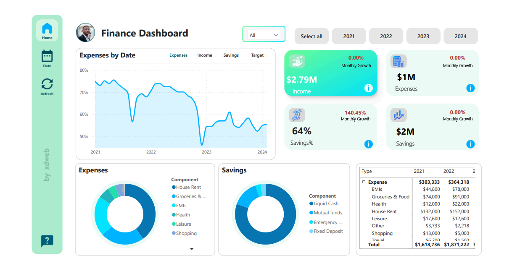

# Finance Dashboard - Power BI


## Overview
The **Finance Dashboard** is a comprehensive visualization project built using Power BI. It showcases income, savings, expenses, and targets, providing actionable insights through interactive charts and dynamic measures.

### Key Features:
- **Dynamic Slicers**: Year and Month filters for granular insights.
- **Donut Charts**: Visualize the breakdown of expenses and savings.
- **Line Chart**: Trends of income, savings, and expenses over time.
- **Dynamic Interactions**: Tooltips and dynamic line chart display.

[**View the Dashboard on Power BI**](https://app.powerbi.com/view?r=eyJrIjoiNGMyYjI2NzEtNjhmMi00NjNkLWJiM2YtOGRkYTU3MTg2NjkyIiwidCI6IjFjOTU3MTRkLTczMWEtNDVmZS04YjY2LWMwNTI2MmY4OGZjZSJ9)

---

## Repository Structure
```plaintext
├── Data/
│   └── financial_data.xlsx      # Data source for the dashboard
├── pbix of project/
│   └── finance_dashboard.pbix   # Power BI project file
├── Resources/
│   ├── Background.png           # Dashboard background
│   ├── graph background G.png   # Chart backgrounds
│   └── icons.svg                # Icon assets
├── screenshots/
│   ├── FinalProject.png         # Snapshot of the final dashboard
│   └── finance_dashboard - Power BI.pdf # Full project presentation
├── Steps/
│   ├── Steps.md                 # Step-by-step project documentation
│   └── Steps.txt                # Additional notes
└── README.md                    # Project overview (this file)
```

---

## Getting Started

### Prerequisites:
- **Power BI Desktop**: Download from [Microsoft's website](https://powerbi.microsoft.com/desktop/).

### Steps to Use:
1. Clone this repository:
   ```bash
   git clone https://github.com/your-username/finance-dashboard-powerbi.git
   ```
2. Open the `finance_dashboard.pbix` file in Power BI.
3. Explore and customize the dashboard as needed.

---

## Project Details

### Data Source
- The project uses a simulated dataset (`financial_data.xlsx`) with the following structure:
  - **Type**: Categories (Income, Savings, Expenses, Target)
  - **Component**: Subcategories of each type (e.g., Groceries, Health)
  - **Date**: Transaction dates
  - **Value**: Monetary amounts

### Key Insights:
- Track monthly income, savings, and expenses.
- Visualize expense and savings breakdown by category.
- Analyze trends over time for better financial planning.

### Calculated Measures:
- Total Value, Income, Savings, Expenses
- Savings Percentage
- Dynamic Line Chart Selection

For a detailed walkthrough of the project setup, refer to [`Steps.md`](Steps/Steps.md).

---

## Screenshots


---

## Author
**Taibi El Yakouti**  
- [LinkedIn](https://www.linkedin.com/in/xdweb/)  
- [GitHub](https://github.com/xDweeb)  
- [Kaggle](https://www.kaggle.com/xdweeb)  

---